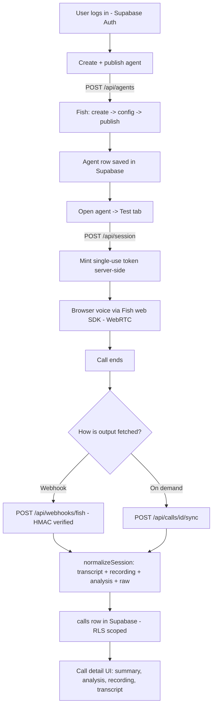

# POC Walkthrough — Evaluating Fish Audio as an ElevenLabs Replacement

This document narrates **what we built and why**, from first research to the working
multi-user dashboard. It's the guided tour; for the terse reference see
[`README.md`](./README.md), and for the original plan/research see
[`IMPLEMENTATION_PLAN.md`](./IMPLEMENTATION_PLAN.md).

---

## 1. The goal

Our production product **VOLA** runs its voice calling on **ElevenLabs Conversational AI**
(ASR + TTS + telephony + agent orchestration + webhooks + transcripts + RAG — see
[`elevenlabs-capabilities.md`](./elevenlabs-capabilities.md)). The question this POC answers:

> **Can Fish Audio replace ElevenLabs for VOLA?**

Rather than a throwaway script, we built a small but real product — login, an in-app agent
builder, live browser voice testing, and post-call analysis — so the evaluation exercises the
same surfaces VOLA depends on.

---

## 2. How we got here (the journey)

| Stage | What happened | Artifact |
|-------|---------------|----------|
| **Research** | Fetched the entire Fish Audio docs and cataloged its capabilities & APIs. Key discovery: Fish has a full **Voice Agents platform**, not just TTS. | [`FISH_AUDIO_CAPABILITIES.md`](./FISH_AUDIO_CAPABILITIES.md) |
| **Baseline** | Documented exactly how VOLA uses ElevenLabs, so we knew what "parity" means. | [`elevenlabs-capabilities.md`](./elevenlabs-capabilities.md) |
| **Plan** | Chose a thin vertical slice: browser voice (no telephony cost), Fish's built-in LLM, Next.js + shadcn. | [`IMPLEMENTATION_PLAN.md`](./IMPLEMENTATION_PLAN.md) |
| **Slice 1** | Scaffolded the app; built the core loop: create agent → mint token → browser voice → webhook → call detail. | commit `Scaffold VOLA-lite POC` |
| **Dashboard + Auth** | Added Supabase Auth (email/password) + a multi-user dashboard with an in-app agent builder. | commit `Add login, dashboard…` |
| **Admin** | Added a super-admin role that sees every user's agents and calls (RLS-based). | commit `Add super-admin role…` |
| **Edit + rich detail** | Agent editing/republish; full call output (transcript, recording, analysis, tool calls, raw); on-demand "Sync from Fish". | commit `Add agent editing + rich call detail` |

---

## 3. What it does (feature tour)

1. **Sign up / log in** (`/signup`, `/login`) — Supabase Auth. Every route under the dashboard
   is gated; unauthenticated users are redirected to `/login`.
2. **Agents list** (`/`) — your agents (scoped to you). "New agent" to build one.
3. **Build an agent** (`/agents/new`) — a form for name, system prompt, first message, voice
   (picked from Fish's voice models), language, turn-taking settings, and **post-call analysis**
   (data fields to extract + success criteria). Submitting runs Fish **create → configure →
   publish** in one step.
4. **Test it** (`/agents/[id]` → Test tab) — a live **browser voice conversation** with the agent
   (mic → ASR → LLM → TTS over WebRTC). Live transcript, mute, interrupt.
5. **See the results** (`/calls/[id]`) — after hanging up, one click to the call detail:
   **summary, extracted data fields, success criteria, per-speaker recording, transcript,
   tool calls, and the raw Fish payload**. It auto-fetches from Fish if not yet populated.
6. **Edit an agent** (`/agents/[id]/edit`) — change any config and save; it re-applies to Fish and
   **publishes a new version**.
7. **History** (`/calls`) — all your calls with status + a derived hot/warm/cold **lead** badge.
8. **Admin** (`/admin`, admins only) — a global view of **every** user's agents and calls with owner emails.

---

## 4. How it's built (architecture)

**Stack:** Next.js 16 (App Router) · TypeScript · Tailwind v4 · shadcn/ui (Base UI) ·
Supabase (Auth + Postgres w/ RLS) · Fish Audio Voice Agents (`@fishaudio/agent-react` over LiveKit WebRTC).

### The core loop

### Key modules

| Area | Files |
|------|-------|
| Fish REST client | `lib/fish.ts` (agents, sessions, recording, voices), `lib/fish-session.ts` (normalize a session into UI fields + raw) |
| Agent config | `lib/agent-config.ts` (form ⇄ Fish `AgentConfig` builder, both directions) |
| Auth | `lib/supabase/{server,client,admin}.ts`, `proxy.ts` + `lib/supabase/middleware.ts` (session refresh + gate), `app/auth-actions.ts` |
| Data | `lib/agents.ts`, `lib/calls.ts`, `lib/admin.ts` — Supabase-backed, RLS for users, service-role for the webhook |
| Webhook | `lib/webhook.ts` (HMAC-SHA256 verify), `app/api/webhooks/fish/route.ts` |
| UI | `components/agent-form.tsx`, `components/voice-call.tsx`, `components/sync-call-button.tsx`, `app/(dashboard)/**` |
| Schema | `supabase/migrations/000{1,2,3}_*.sql` |

### Security model

- **Row-Level Security**: users can only read their own `agents` and `calls`. Enforced in Postgres.
- **Service-role client** (`lib/supabase/admin.ts`) is used *only* server-side by the webhook (which has
  no user session) and by admin reads — after an explicit `is_admin()` check.
- The Fish API key never reaches the browser: the client only ever gets a **single-use session token**
  minted by `/api/session`.
- Webhooks are **HMAC-verified** (reject on bad/absent/stale signature).

---

## 5. The verdict: Fish Audio vs ElevenLabs

**Fish covers most of VOLA's surface.** Its Voice Agents platform has a real agents REST API,
**custom-LLM override** (matching VOLA's qwen-bypass), inbound/outbound phone calls, webhook tools,
dynamic variables, HMAC webhooks, transcripts/recordings, RAG, turn-taking, and post-call analysis.

**The gaps to weigh for the go/no-go:**

1. **No batch/scheduled calling** — you'd build your own queue; **200 outbound calls/workspace/day +
   10 concurrent** is a hard ceiling.
2. **Webhooks omit transcript & recording** — you re-fetch them (this POC does, via `normalizeSession`).
3. **Only 2 system tools** (`hang_up_call`, `transfer_call`) — no voicemail/language-detection tools.
4. **Transfers**: Twilio-only, single destination; SIP numbers can't be transfer targets.
5. **Knowledge base**: `.md`/`.txt` only (≤1 MB) — no PDF/URL/Office ingestion.
6. **Phone inventory**: Twilio numbers are US/Canada only (BYO SIP mitigates, but loses transfer).
7. **SDK packaging**: the official web SDKs publish with unresolved `workspace:^` deps — we work around
   it with npm `overrides` in `package.json`.

**What we deferred** (not blockers, just out of scope for the slice): real PSTN calling + phone
provisioning, custom-LLM wiring, the batch queue, webhook tools (appointments/inventory), transfers,
RAG/KB sync, and OpenAI lead-scoring — each is a known follow-on.

> ⚠️ Endpoints for agent create/config and session read follow the docs; the exact request/response
> shapes should be confirmed against `https://api.fish.audio/openapi.json` on first real use. All Fish
> calls are centralized in `lib/fish.ts` / `lib/fish-session.ts`, and the call detail's **raw** view shows
> exactly what Fish returns.

---

## 6. Running it yourself

1. `npm install` (the `overrides` block handles the Fish SDK packaging quirk).
2. **Supabase**: create a project, then run the SQL in [`supabase-setup.txt`](./supabase-setup.txt)
   (three blocks: base schema, admin, call-detail columns). Turn **off** "Confirm email" in Auth for
   frictionless dev signup.
3. **Env** (`.env.local` — see [`.env.example`](./.env.example)):
   `NEXT_PUBLIC_SUPABASE_URL`, `NEXT_PUBLIC_SUPABASE_ANON_KEY`, `SUPABASE_SERVICE_ROLE_KEY`, `FISH_API_KEY`,
   `FISH_WEBHOOK_SECRET`, and (only for webhooks) `PUBLIC_BASE_URL`.
4. `npm run dev` → sign up → **New agent** → **Test** → speak → **View call details**.
5. (Optional) To make yourself an admin, run the grant-admin snippet in `supabase-setup.txt` after signing up.
6. (Optional) To receive live webhooks, expose the app with a tunnel (ngrok/Cloudflare), set
   `PUBLIC_BASE_URL`, and point the Fish console webhook at `${PUBLIC_BASE_URL}/api/webhooks/fish` with your
   `FISH_WEBHOOK_SECRET`. Without this, the call detail's **Sync from Fish** fetches everything on demand.

---

## 7. What each migration adds

| Migration | Adds | For |
|-----------|------|-----|
| `0001_init.sql` | `agents` + `calls` tables + RLS | everything |
| `0002_admin.sql` | `admins` table, `is_admin()`, admin read policies | the Admin view |
| `0003_call_details.sql` | `tool_calls`, `raw`, `language` columns on `calls` | rich call detail |

All three are consolidated (idempotent) in [`supabase-setup.txt`](./supabase-setup.txt).
